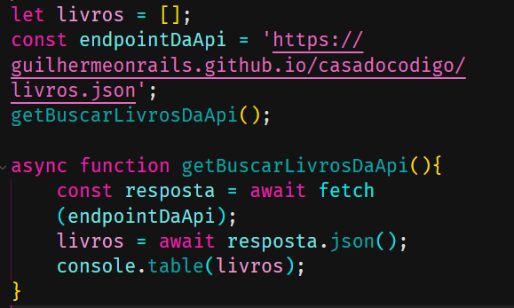

# Projeto-Alura-Books

O código JavaScript incia com uma busca de lista de livros em um site e a mostra na tela. A função getBuscarLivrosDaApi() faz isso da seguinte maneira:

    

livros: Uma lista vazia para guardar os livros. 
endpointDaApi: O endereço do site com os livros. 
Pega os livros: A função getBuscarLivrosDaApi() é chamada para buscar os livros. Ela: 
  - Busca os livros no site (enderecoDaApi). 
  - Armazena os livros na lista livros. 
  - Mostra a lista de livros na tela. 
O código busca livros em um site e os mostra na tela. A função getBuscarLivrosDaApi() faz o trabalho: busca os livros, guarda-os e os mostra.
